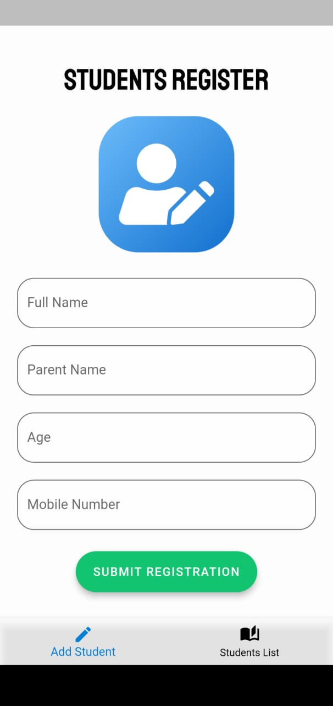
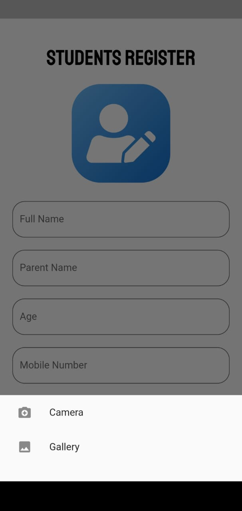
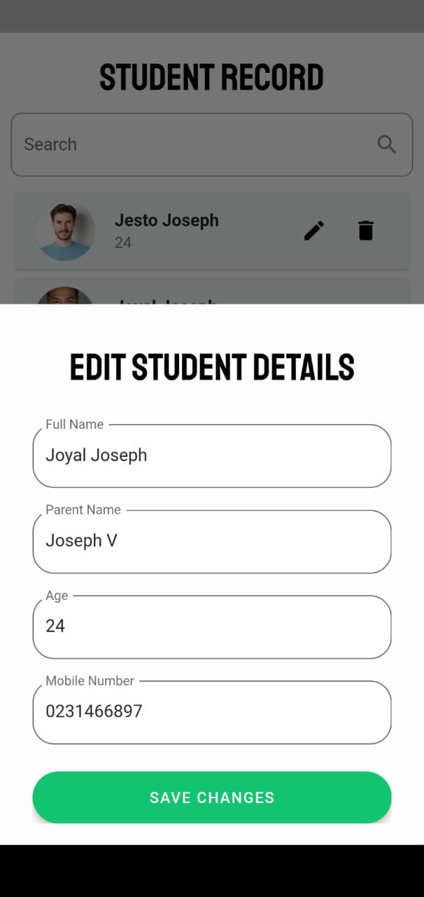
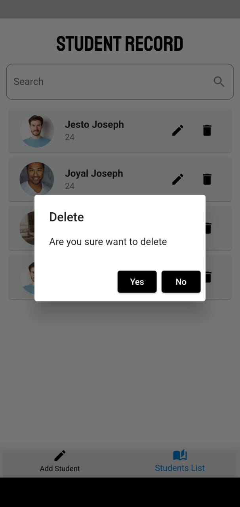
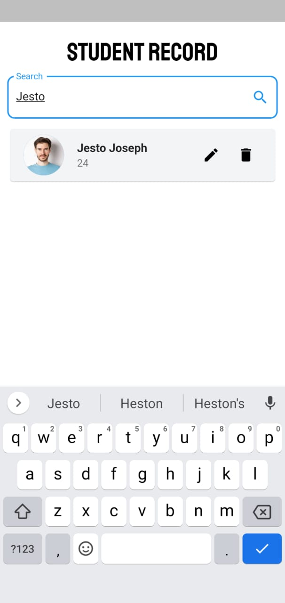

**Project Name: Student Registration App**

## Description
Welcome to the Student Registration App! This project is a Flutter application designed to simplify the process of registering and managing student profiles. It provides an intuitive user interface and a range of features to streamline student information management. 

## Key Features
1. **Add New Students:** Easily add new students to the app by entering their name, parent name, age, and phone number.
2. **Edit and Update:** Modify student details whenever needed. The app allows you to edit and update information seamlessly.
3. **Delete Option:** If a student record is no longer required, simply delete it from the app with a single click.
4. **Search Functionality:** Quickly search for specific students using their name or any other relevant criteria, saving time and effort.
5. **List View:** Browse through all registered students in a visually appealing list view, making it convenient to scan and locate specific profiles.
6. **Detailed Profile View:** Get comprehensive information about each student in a detailed profile view, including their personal details.
7. **User-Friendly Interface:** The app features an intuitive and user-friendly interface, ensuring a smooth and hassle-free experience for both administrators and users.
8. **Efficient Data Management:** All student information is stored securely and efficiently, allowing for easy access and management.
9. **Flutter-Powered:** Built with Flutter, a popular cross-platform framework, the app ensures seamless performance on both Android and iOS devices.

## Screen Shorts

## Get Started
To get started with the Student Registration App, follow these steps:
1. Clone the repository to your local machine.
2. Install Flutter and its dependencies.
3. Run the app on your preferred emulator or physical device.
4. Explore the various features of the app and start managing student registrations effortlessly.

## Contributing
We welcome contributions to enhance the Student Registration App. If you have any ideas, bug fixes, or feature requests, please submit a pull request. Your contributions will be greatly appreciated!

## Contact
If you have any questions or feedback regarding the Student Registration App, please feel free to reach out to us at hellotechmalayalam@gmail.com. We value your input and would be happy to assist you.

Let's simplify student registration together with the Student Registration App! 🎓📝